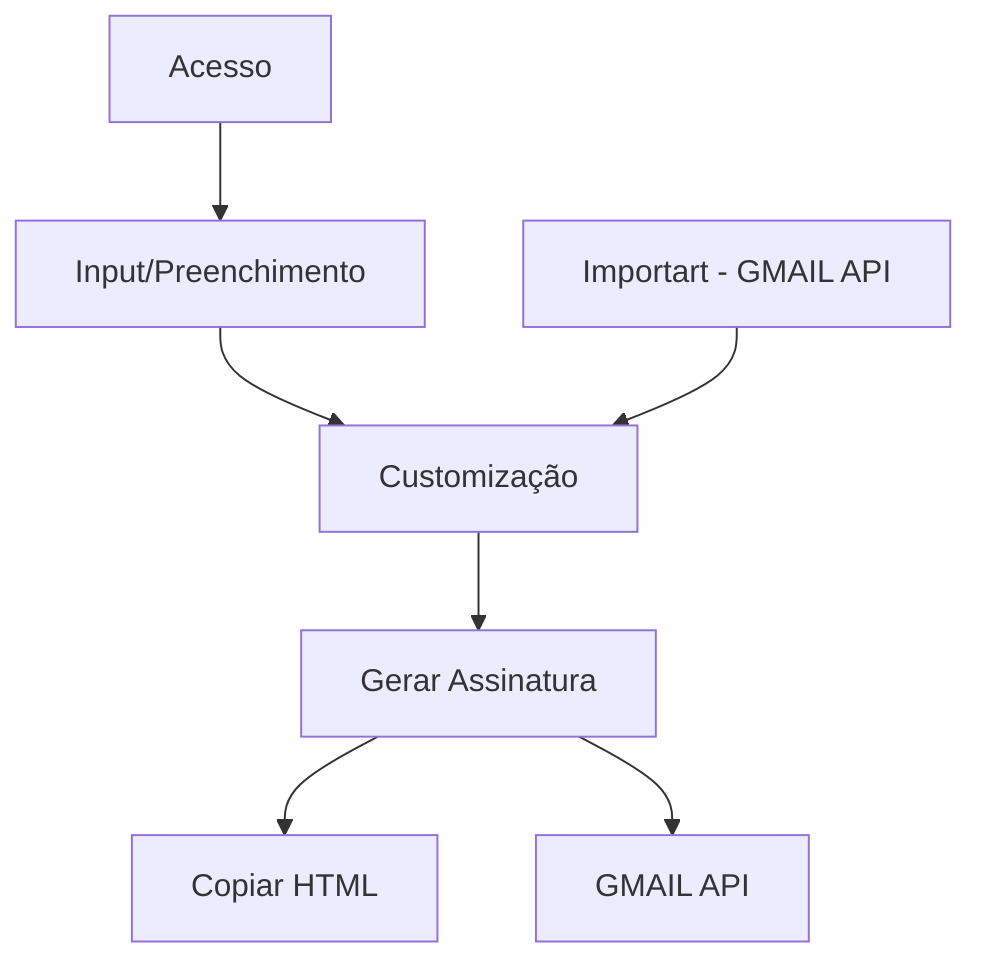

# **`GAE`** - **G**erador de **A**ssinatura de **E**-mails

## *Ideia*
Desenvolver uma aplicação que crie assinaturas de e-mail responsivas para pessoas ou empresas, de forma customizável e que seja de código livre (*open source*).

## *Referências*

> [Resultados Digitais](https://resultadosdigitais.com.br/ferramentas/assinatura-de-email/cadastro)

> [Hubspot](https://br.hubspot.com/email-signature-generator)

> [Mysignature](https://pt.mysignature.io/editor)

> [Newoldstamp](https://newoldstamp.com/editor/)

> [Wisestamp](https://webapp.wisestamp.com/?_ga=2.55767586.803905847.1596758964-1697072610.1596758964)

> [htmlsig](https://htmlsig.com/#main-container)

> [Rock Content](https://rockstamp.rockcontent.com/#assinatura)

## *Projeto*

### **Fluxo**

### **Descritivo**
- [ ] Gerar assinatura à partir de um input de dados (*form*)

- [ ] Criar e validar inputs

  - [ ] Cores
    - [ ] Destaque
    - [ ] Primária
    - [ ] Secundária

  - [ ] Tamanho de texto

  - [ ] Foto
    - [ ] Logo da empresa
    - [ ] Foto da pessoa
    - [ ] Inserir Link

  - [ ] Nome (*Mínimo 2 letras*)

  - [ ] E-mail
    - [ ] Customização para empresa (*@empresa.com; @empresa e .*)
    - [ ] Padrão (*@empresa.com; @ e .*)
    - [ ] Inserir Link (*mailto*)

  - [ ] Telefone
    - [ ] Customização para empresa (*Fixo*)
    - [ ] Telefone pessoal (*+55 11 9 9999-9999*)
    - [ ] Inserir Link (*tel*)

  - [ ] Redes Sociais (*Opcional*)
    - [ ] Adicionar links
    - [ ] Customização para empresa
    - [ ] Inserir Link

- [ ] Os dados devem preencher a assinatura automáticamente (*live preview; onkeypress*)

- [ ] Copiar para área de transferência

- [ ] Exportar HTML

- [ ] Exportar para o Gmail (*API*)

### **Monetização**

- [ ] Carbon

- [ ] Google Adsense

- [ ] Donate
